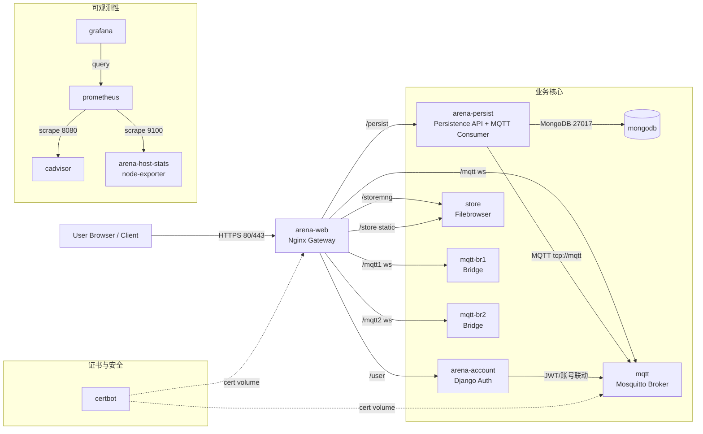
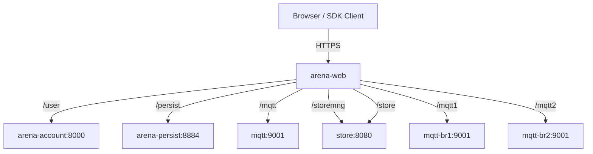
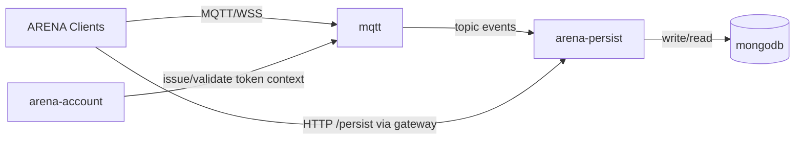
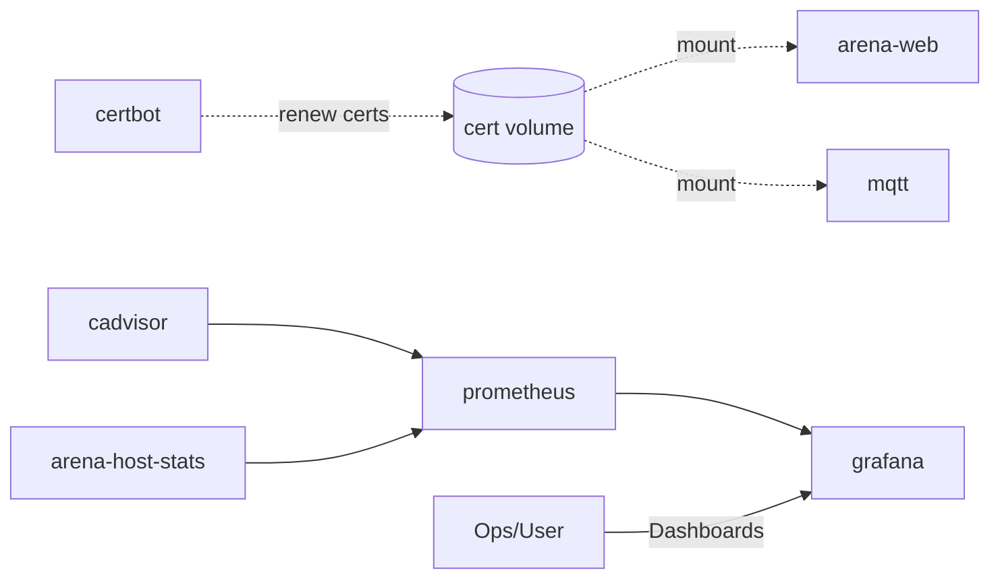

# ARENA Docker 项目架构全景说明

本文基于仓库内的 `docker-compose*.yaml`、`README`、`conf-templates`、`Dockerfile` 等文件整理，目标是系统化说明容器职责、关系与子系统边界。

---

## 1. 项目定位与运行形态

该项目是一个以 Docker Compose 组织的 ARENA 服务编排仓库，核心由以下两类配置组成：

- **基础层**：`docker-compose.yaml`（核心业务服务）
- **环境层**：`docker-compose.prod.yaml`、`docker-compose.staging.yaml`、`docker-compose.demo.yaml`（叠加基础层）与 `docker-compose.localdev.yaml`（独立开发栈）

常用启动模式：

- **生产**：`docker-compose.yaml + docker-compose.prod.yaml`
- **预发/远程开发**：`docker-compose.yaml + docker-compose.staging.yaml`
- **演示**：`docker-compose.yaml + docker-compose.demo.yaml`
- **本地开发**：`docker-compose.localdev.yaml`

---

## 2. 容器总清单（跨所有 compose 去重）

> 说明：默认使用 Docker Compose 默认网络（未显式声明自定义 network），服务通过服务名互相解析。

| Container/Service | 主要来源 | 核心职责 | 关键端口/协议 |
|---|---|---|---|
| `arena-web` | base + all env | Nginx 网关与静态站点；统一入口，反向代理业务服务 | `80/443` HTTPS、WebSocket 反代 |
| `mongodb` | base + all env | 主数据存储（场景持久化） | `27017` |
| `arena-persist` | base + all env | 持久化服务：订阅 MQTT + 写入 MongoDB + 提供 `/persist` HTTP | 内部 `8884`（经 `arena-web` 反代） |
| `arena-account` | base + all env | Django 账户认证/用户管理/OAuth | `8000`（经 `arena-web` 反代 `/user`） |
| `mqtt`（容器名常见 `arena-broker`） | base + all env | 消息总线（Mosquitto + JWT 认证） | `8083`(WSS), `8883`(MQTT TLS), 内部 `9001`(WS) |
| `mqtt-br1` | prod | MQTT bridge 节点（网关 `/mqtt1`） | 内部 `9001` |
| `mqtt-br2` | prod | MQTT bridge 节点（网关 `/mqtt2`） | 内部 `9001` |
| `store`（容器名常见 `arena-store`） | base + all env | 文件存储与文件管理（Filebrowser） | 内部 `8080`（经 `arena-web` 反代 `/storemng`） |
| `certbot` | prod/staging | 证书签发与续期（Let's Encrypt） | 文件卷交互（非典型服务端口） |
| `cadvisor` | prod/staging | 容器资源监控采集端 | `8080`（staging 暴露） |
| `arena-host-stats` | prod/staging | 主机指标导出（node-exporter） | `9100`（Prometheus 抓取） |
| `prometheus` | prod/staging | 指标采集与存储 | `9090`（默认内部） |
| `grafana` | prod/staging | 可视化看板 | `3000` |
| `mongo-express` | admin 扩展 | MongoDB GUI 管理工具（开发/测试） | 主机 `4567 -> 容器8081` |

---

## 3. 各环境编排差异

### 3.1 `docker-compose.yaml`（基础层）

- 定义核心服务：`arena-web`、`mongodb`、`arena-persist`、`arena-account`、`mqtt`、`store`
- 构建来源以本地子模块为主（`arena-web-core`、`arena-persist`、`arena-account`）
- 形成最小可运行业务闭环：入口网关 + 认证 + 消息 + 持久化 + 文件服务 + 数据库

### 3.2 `docker-compose.prod.yaml`（生产增强）

- 将核心服务切换为版本化镜像（通过 `VERSION` 与环境变量管理）
- 加入 `certbot` 自动续证
- 加入 MQTT bridge：`mqtt-br1`、`mqtt-br2`
- 加入可观测性栈：`cadvisor` + `arena-host-stats` + `prometheus` + `grafana`

### 3.3 `docker-compose.staging.yaml`（预发/远程开发）

- 结构接近生产，但部分服务用本地 build、网关挂载源码与 `../dev` 目录，便于联调
- 同样包含证书与监控组件

### 3.4 `docker-compose.demo.yaml`（演示）

- 面向快速演示，使用预构建镜像
- 组件较精简：无监控、无 bridge

### 3.5 `docker-compose.localdev.yaml`（本地开发独立栈）

- 不叠加基础 compose，单文件自包含
- 核心业务闭环齐全，但去掉监控与证书服务

### 3.6 `docker-compose-admin-mongo.yaml`（管理扩展）

- 在已有栈基础上扩展 `mongo-express`，便于数据库可视化运维

---

## 4. 子系统拆解与容器关系

## A. 访问入口与流量调度子系统

**核心容器**：`arena-web`  
**关键配置**：`conf-templates/*/arena-web.conf.tmpl`

- 统一暴露 `80/443`
- 负责 TLS 终止与静态资源服务（`arena-web-core`、`/store`、`/conf`、`/user/static`）
- 反向代理主要业务路径：
  - `/mqtt` -> `mqtt:9001`
  - `/mqtt1` -> `mqtt-br1:9001`（prod）
  - `/mqtt2` -> `mqtt-br2:9001`（prod）
  - `/persist` -> `arena-persist:8884/persist/`
  - `/user` -> `arena-account:8000`
  - `/storemng` -> `store:8080`

**系统意义**：把浏览器端的多协议访问（HTTP/HTTPS/WebSocket）统一到单入口，降低客户端配置复杂度。

## B. 实时消息与认证子系统

**核心容器**：`mqtt`（可扩展 `mqtt-br1/2`）  
**关键配置**：`conf-templates/mosquitto.conf.tmpl`

- 提供 MQTT/MQTT over WS/WSS 能力
- 使用 JWT 插件进行客户端认证（公钥挂载至 broker）
- `arena-persist` 与前端客户端均依赖该消息总线
- 生产下可通过 bridge 节点横向分担接入流量或做多链路代理

## C. 持久化子系统

**核心容器**：`arena-persist` + `mongodb`  
**关键配置**：`conf-templates/persist-config.json.tmpl`

- `arena-persist` 订阅消息总线上的对象变更，按规则写入 `mongodb`
- 同时对外提供 HTTP 持久化查询/克隆接口（经 `arena-web` 统一暴露为 `/persist`）
- `persist-config.json` 明确使用服务发现地址 `mqtt`、`mongodb`

## D. 账号认证与身份子系统

**核心容器**：`arena-account`  
**关键配置**：`conf-templates/account-settings.py.tmpl`

- Django 应用，提供账户、OAuth、token 相关能力
- 通过 `MQTT_TOKEN_PRIVKEY` 与 MQTT/JWT 体系联动
- 其静态资源通过共享卷提供给 `arena-web` 对外服务

## E. 文件存储子系统

**核心容器**：`store`（Filebrowser）

- 提供文件上传、管理、分享能力
- `arena-web` 代理管理接口 `/storemng` 到 `store:8080`
- 公共资源通过 `/store` 静态路径和重写规则访问

## F. 证书与安全运维子系统

**核心容器**：`certbot`（prod/staging）

- 周期性续签证书
- 与 `arena-web`、`mqtt` 通过共享卷交换证书文件
- 保证 HTTPS/WSS/MQTT TLS 通道可持续可用

## G. 可观测性子系统（prod/staging）

**核心容器**：`cadvisor`、`arena-host-stats`、`prometheus`、`grafana`

- `cadvisor` 暴露容器级指标
- `arena-host-stats` 暴露主机级指标
- `prometheus` 按配置抓取上述指标
- `grafana` 读取 `prometheus` 做可视化

---

## 5. 总体调用链（简述）

1. 用户浏览器访问 `arena-web`（HTTPS 入口）
2. 页面静态资源由 `arena-web` 直接提供；动态能力通过反代进入后端
3. 实时交互消息走 `/mqtt` 到 `mqtt`
4. 持久化读写通过 `/persist` 到 `arena-persist`，再访问 `mongodb`
5. 账号认证通过 `/user` 到 `arena-account`
6. 文件管理通过 `/storemng` 到 `store`
7. 生产环境中，监控链路由 `prometheus` 抓取 exporters，`grafana` 展示

---

## 6. 总图（全栈）

---

## 7. 子系统图（一）：入口网关与业务代理

---

## 8. 子系统图（二）：消息与持久化路径

---

## 9. 子系统图（三）：证书与可观测性

---

## 10. 关键文件索引（架构依据）

- 编排入口：
  - `docker-compose.yaml`
  - `docker-compose.prod.yaml`
  - `docker-compose.staging.yaml`
  - `docker-compose.demo.yaml`
  - `docker-compose.localdev.yaml`
  - `docker-compose-admin-mongo.yaml`
- 网关路由与跨容器调用：
  - `conf-templates/prod/arena-web.conf.tmpl`
  - `conf-templates/staging/arena-web.conf.tmpl`
  - `conf-templates/localdev/arena-web.conf.tmpl`
  - `conf-templates/demo/arena-web.conf.tmpl`
- 消息与持久化配置：
  - `conf-templates/mosquitto.conf.tmpl`
  - `conf-templates/persist-config.json.tmpl`
- 认证配置：
  - `conf-templates/account-settings.py.tmpl`
- 监控抓取配置：
  - `conf/prod/prometheus.yml`
  - `conf/staging/prometheus.yml`
- 服务镜像构建来源：
  - `arena-web-core/Dockerfile`
  - `arena-account/Dockerfile`
  - `arena-persist/Dockerfile`
  - `init-utils/Dockerfile`

---

## 11. 架构特征总结

- **入口统一**：以 `arena-web` 作为单入口，业务路径清晰、客户端接入成本低。
- **消息驱动 + 数据落库**：`mqtt` 与 `arena-persist` 形成实时/持久双通路。
- **部署分层**：基础服务与环境增量分离，便于在 prod/staging/demo/dev 之间切换。
- **运维可观测**：生产级监控链路完整，可覆盖容器与主机两个维度。
- **配置模板化**：`conf-templates` + `init.sh` 将环境变量注入配置，降低手工维护成本。

