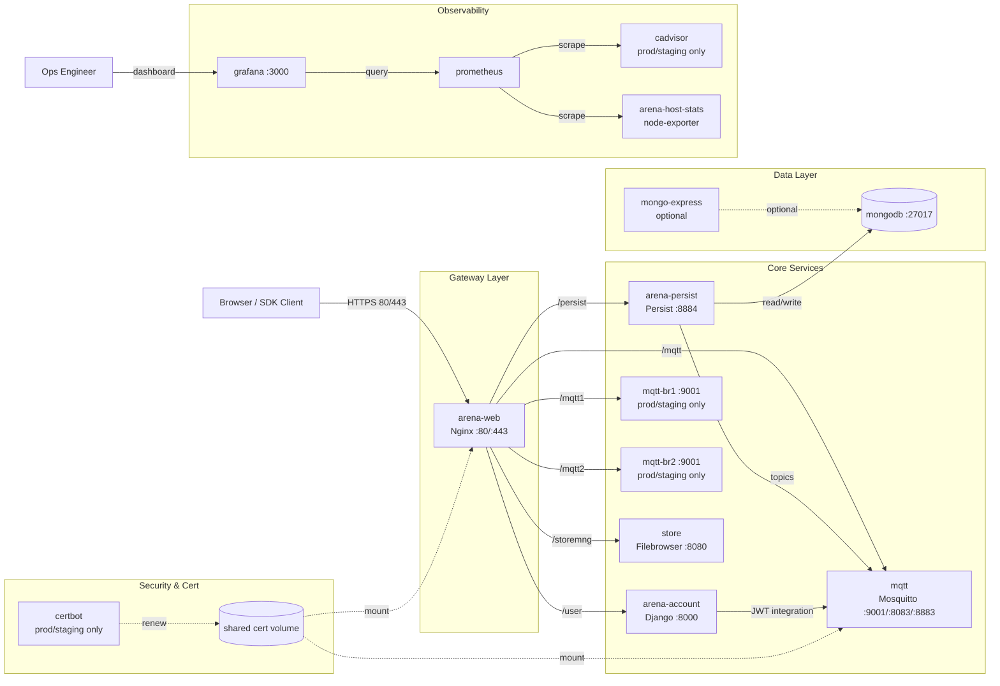

# ARENA Docker 系统架构图（GPT 生图专用）

本文档用于让 GPT（或其他文生图模型）根据当前仓库的 Docker Compose 编排，生成一张**学术论文风格（paper-style）**、可用于技术报告/论文附图的系统架构图。

---

## 1) 架构事实基线（来自仓库编排）

核心编排来源：
- `docker-compose.yaml`（基础栈）
- `docker-compose.prod.yaml`（生产增强）
- `docker-compose.staging.yaml`（预发增强）
- `docker-compose.localdev.yaml`（本地开发独立栈）
- `docker-compose.demo.yaml`（演示栈）
- `docker-compose-admin-mongo.yaml`（Mongo GUI 扩展）

核心服务：
- `arena-web`：Nginx 网关与静态站点统一入口（80/443）
- `arena-account`：Django 账户系统（内部 8000，经网关 `/user`）
- `arena-persist`：持久化服务（内部 8884，经网关 `/persist`）
- `mqtt`：Mosquitto + JWT 认证消息总线（9001/8083/8883）
- `mongodb`：数据存储（27017）
- `store`：Filebrowser 文件服务（内部 8080，经网关 `/storemng`）

生产/预发增强组件：
- `certbot`：证书续期（与 `arena-web`、`mqtt` 共享证书卷）
- `mqtt-br1`、`mqtt-br2`：MQTT bridge（网关 `/mqtt1`、`/mqtt2`）
- 观测栈：`cadvisor`、`arena-host-stats`(node-exporter)、`prometheus`、`grafana`

开发管理扩展：
- `mongo-express`：MongoDB GUI（`4567 -> 8081`）

关键反向代理路径（Nginx）：
- `/mqtt` -> `mqtt:9001`
- `/mqtt1` -> `mqtt-br1:9001`（prod）
- `/mqtt2` -> `mqtt-br2:9001`（prod）
- `/persist` -> `arena-persist:8884/persist/`
- `/user` -> `arena-account:8000`
- `/storemng` -> `store:8080`
- `/store` -> 静态文件目录

---

## 2) 给 GPT 的生图主提示词（学术版，可直接复制）

```text
请绘制一张“ARENA Docker 系统架构图”（academic paper figure，不是插画），要求风格接近计算机论文中的系统图（例如 NSDI/SOSP/USENIX 附图风格）：克制、严谨、低饱和、强调结构与语义，不使用卡通图标。

【总体布局（论文图规范）】
1. 采用严格从左到右的数据流布局，避免交叉线。
2. 分为 6 个分区（矩形分组框 + 分区标题）：
   - Client Access（最左侧）
   - Gateway Layer
   - Core Services
   - Data Layer
   - Security & Cert
   - Observability（最右侧）
3. 图中所有节点使用统一几何形状与统一线宽：
   - 容器：圆角矩形
   - 数据卷/数据库：圆柱或双线矩形
   - 外部参与者（Browser/Ops）：普通矩形
4. 每个节点标签采用“主名称 + 角色 + 关键端口”三段式，字体一致。
5. 在图标题下方加入图注：`Figure: ARENA service architecture on Docker Compose default network`.

【分区与节点】
A. Client Access：
   - Browser / SDK Client
   - Ops Engineer（用于访问 Grafana）

B. Gateway Layer：
   - arena-web (Nginx Gateway)
   - 标注端口：80/443
   - 标注能力：TLS termination, static hosting, reverse proxy

C. Core Services：
   - arena-account (Django Auth Service, :8000 internal)
   - arena-persist (Persistence Service, :8884 internal)
   - mqtt (Mosquitto Broker, ws:9001, wss:8083, mqtt-tls:8883)
   - mqtt-br1 (Bridge, :9001 internal, prod)
   - mqtt-br2 (Bridge, :9001 internal, prod)
   - store (Filebrowser, :8080 internal)

D. Data Layer：
   - mongodb (:27017)

E. Security & Cert：
   - certbot (Let's Encrypt renew loop)
   - shared cert volume（作为“卷”图标，不是容器）

F. Observability：
   - cadvisor
   - arena-host-stats (node-exporter)
   - prometheus
   - grafana (:3000)

【必须画出的链路（带编号与语义标签）】
1. Browser / SDK Client -> arena-web ：“(F1) HTTPS 80/443”
2. arena-web -> arena-account ：“(F2) /user -> :8000”
3. arena-web -> arena-persist ：“(F3) /persist -> :8884”
4. arena-web -> mqtt ：“(F4) /mqtt -> :9001 (WebSocket)”
5. arena-web -> mqtt-br1 ：“(F5) /mqtt1 -> :9001”
6. arena-web -> mqtt-br2 ：“(F6) /mqtt2 -> :9001”
7. arena-web -> store ：“(F7) /storemng -> :8080”
8. arena-persist -> mqtt ：“(F8) subscribe/publish topics”
9. arena-persist -> mongodb ：“(F9) read/write scene state”
10. arena-account -> mqtt ：“(F10) JWT auth integration”
11. certbot -> shared cert volume ：“(C1) renew certs”
12. shared cert volume -> arena-web ：“(C2) mount /etc/letsencrypt”
13. shared cert volume -> mqtt ：“(C3) mount TLS certs”
14. prometheus -> cadvisor ：“(M1) scrape metrics”
15. prometheus -> arena-host-stats ：“(M2) scrape host metrics”
16. grafana -> prometheus ：“(M3) query metrics”
17. Ops Engineer -> grafana ：“(M4) dashboard :3000”

【视觉规范（学术图）】
1. 使用低饱和配色与高对比文字，背景纯白。
2. 分区底色仅用 5%~10% 浅灰/浅色，不使用渐变、阴影、3D 效果。
3. 线条统一：1.2px；箭头大小一致；节点圆角一致。
4. 实线箭头表示业务与数据路径；虚线箭头表示挂载/证书/配置路径。
5. 在图右下角提供标准图例（Legend），并包含线型语义说明。
6. 字体建议：Inter/Helvetica/Arial；标题 18-22，节点 12-14，边标签 10-11。
7. 避免营销化视觉元素：不要人物插画、不要拟物图标、不要霓虹色。

【精度与可复现性要求】
1. 这是 Docker Compose 单机/单主机场景，不要画 Kubernetes 元素（不要 Pod、Service、Ingress）。
2. 容器之间默认在同一 Docker 网络可服务名互访，可在图角落标注“default compose network”。
3. `mqtt-br1`/`mqtt-br2`、`certbot`、observability 组件属于生产/预发增强，可加小标签“prod/staging only”。
4. `mongo-express` 不是主路径，作为右下角可选扩展节点，用虚线连接到 mongodb，标签“dev/admin optional”。
5. 图中需出现清晰标题、图例、分区名、边标签编号（F*/C*/M*），满足论文插图“可独立阅读”要求。

请输出为一张清晰、严谨、可发表风格的系统架构图。
```

---

## 3) 极简版提示词（学术快速版）

```text
绘制 ARENA Docker Compose 架构图（16:9，academic paper figure 风格）：
左侧 Browser/SDK -> arena-web(Nginx 80/443)；
arena-web 反代到 arena-account(:8000,/user)、arena-persist(:8884,/persist)、mqtt(:9001,/mqtt)、mqtt-br1(:9001,/mqtt1)、mqtt-br2(:9001,/mqtt2)、store(:8080,/storemng)；
arena-persist 连 mqtt 与 mongodb(:27017)；
arena-account 与 mqtt 有 JWT 集成关系；
certbot 通过 shared cert volume 给 arena-web 与 mqtt 提供证书；
observability: prometheus 抓取 cadvisor + node-exporter(arena-host-stats)，grafana 查询 prometheus(:3000)；
标注 default compose network，prod/staging only 标签给 certbot、mqtt-br1/2、observability；
可选虚线节点 mongo-express -> mongodb（dev/admin optional）；
所有链路加编号（F1..F10, C1..C3, M1..M4），包含标准图例，低饱和配色、无渐变无3D。
```

---

## 4) Mermaid 草图（用于先验结构校验）



---

## 5) 建议出图参数

- 比例：`16:9`
- 分辨率：`1792x1024` 或 `1536x896`
- 风格关键词：`academic system diagram, paper figure style, low saturation, high structural clarity, formal legend`
- 负面约束：`no kubernetes objects, no anime, no photorealistic scene, no 3d rendering, no glossy icons, no visual clutter`

---

## 6) 可选：黑白打印友好约束（论文投稿常用）

若目标是论文打印版，可在提示词末尾追加：

```text
Use a grayscale-friendly palette. Distinguish relation types by line style (solid/dashed/dotted) and arrowhead shape rather than color only. Ensure readability when printed in black and white.
```

